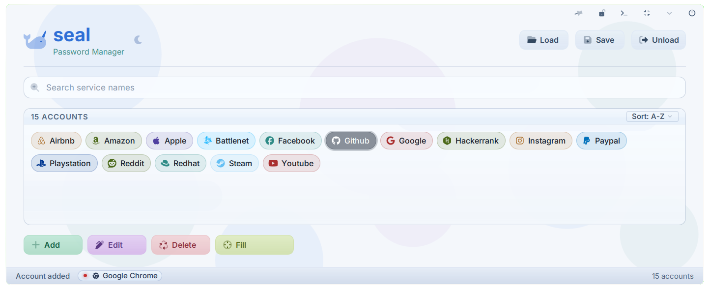
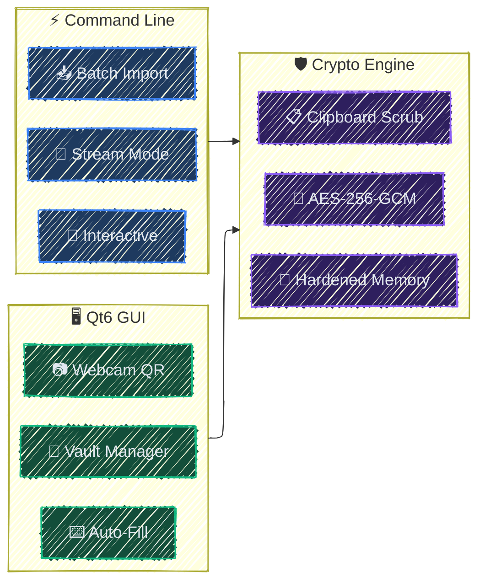
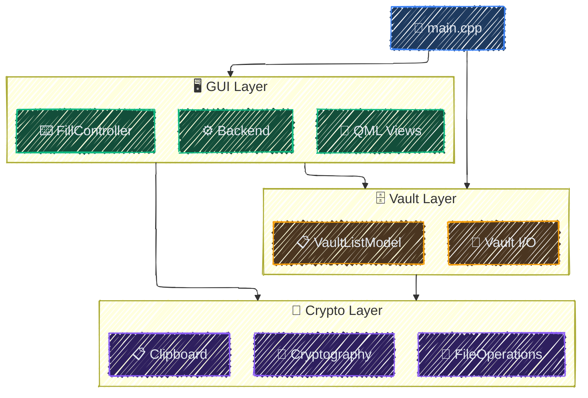

<div align="center">

# seal
**AES-256-GCM with Qt6 GUI providing on-demand credential management**

🛡️ [Features](#features) | 🚅 [Quick Start](#quick-start) | 📗 [Documentation](#documentation) | 🤝 [Contributing](./CONTRIBUTING.md)

![AES-256-GCM](https://img.shields.io/badge/AES--256-GCM-06B6D4.svg?style=flat&logo=data:image/svg+xml;base64,PHN2ZyBmaWxsPSIjZmZmZmZmIiBoZWlnaHQ9IjE2OHB4IiB3aWR0aD0iMTY4cHgiIHZlcnNpb249IjEuMSIgaWQ9IkxheWVyXzEiIHhtbG5zPSJodHRwOi8vd3d3LnczLm9yZy8yMDAwL3N2ZyIgeG1sbnM6eGxpbms9Imh0dHA6Ly93d3cudzMub3JnLzE5OTkveGxpbmsiIHZpZXdCb3g9Ii0yNS42IC0yNS42IDU2My4yMCA1NjMuMjAiIHhtbDpzcGFjZT0icHJlc2VydmUiPjxnIGlkPSJTVkdSZXBvX2JnQ2FycmllciIgc3Ryb2tlLXdpZHRoPSIwIj48L2c+PGcgaWQ9IlNWR1JlcG9fdHJhY2VyQ2FycmllciIgc3Ryb2tlLWxpbmVjYXA9InJvdW5kIiBzdHJva2UtbGluZWpvaW49InJvdW5kIj48L2c+PGcgaWQ9IlNWR1JlcG9faWNvbkNhcnJpZXIiPiA8Zz4gPGc+IDxnPiA8cGF0aCBkPSJNMjU2LDMyMGMtMTEuNzc2LDAtMjEuMzMzLDkuNTc5LTIxLjMzMywyMS4zMzNjMCwxMS43NTUsOS41NTcsMjEuMzMzLDIxLjMzMywyMS4zMzNzMjEuMzMzLTkuNTc5LDIxLjMzMy0yMS4zMzMgQzI3Ny4zMzMsMzI5LjU3OSwyNjcuNzc2LDMyMCwyNTYsMzIweiI+PC9wYXRoPiA8cGF0aCBkPSJNMzYyLjY2NywyMDguMzJWMTA2LjY2N0MzNjIuNjY3LDQ3Ljg1MSwzMTQuODE2LDAsMjU2LDBTMTQ5LjMzMyw0Ny44NTEsMTQ5LjMzMywxMDYuNjY3VjIwOC4zMiBjLTM4Ljk1NSwzMS4yOTYtNjQsNzkuMjUzLTY0LDEzMy4wMTNDODUuMzMzLDQzNS40MzUsMTYxLjg5OSw1MTIsMjU2LDUxMnMxNzAuNjY3LTc2LjU2NSwxNzAuNjY3LTE3MC42NjcgQzQyNi42NjcsMjg3LjU3Myw0MDEuNjIxLDIzOS42MTYsMzYyLjY2NywyMDguMzJ6IE0xOTIsMTA2LjY2N2MwLTM1LjI4NSwyOC43MTUtNjQsNjQtNjRzNjQsMjguNzE1LDY0LDY0djc2LjQ1OSBjLTIuMDkxLTAuODMyLTQuMjQ1LTEuNDUxLTYuMzU3LTIuMjE5Yy0yLjY4OC0wLjk4MS01LjMzMy0yLjAwNS04LjA4NS0yLjgzN2MtMi44NTktMC44NzUtNS44MDMtMS41MzYtOC43MjUtMi4yNjEgYy0yLjQzMi0wLjU5Ny00LjgyMS0xLjMwMS03LjI5Ni0xLjc5MmMtMy40NTYtMC42ODMtNi45NzYtMS4xMzEtMTAuNDc1LTEuNmMtMi4wNDgtMC4yNzctNC4wMzItMC42ODMtNi4xMDEtMC44OTYgYy01LjYxMS0wLjU1NS0xMS4yNjQtMC44NTMtMTYuOTYtMC44NTNzLTExLjM0OSwwLjI5OS0xNi45NiwwLjg1M2MtMi4wNjksMC4yMTMtNC4wNzUsMC42MTktNi4xMDEsMC44OTYgYy0zLjUyLDAuNDY5LTcuMDE5LDAuOTE3LTEwLjQ3NSwxLjZjLTIuNDc1LDAuNDkxLTQuODY0LDEuMTk1LTcuMzE3LDEuNzkyYy0yLjkwMSwwLjcyNS01Ljg0NSwxLjM4Ny04LjcwNCwyLjI2MSBjLTIuNzUyLDAuODMyLTUuNDE5LDEuODc3LTguMTA3LDIuODM3Yy0yLjExMiwwLjc2OC00LjI2NywxLjM4Ny02LjMzNiwyLjIxOVYxMDYuNjY3eiBNMzQxLjMzMywzNjIuNjY3aC0yNS4yNTkgYy02LjQ0MywxOC4wNjktMjAuNjcyLDMyLjI5OS0zOC43NDEsMzguNzQxdjI1LjI1OWMwLDExLjc3Ni05LjUzNiwyMS4zMzMtMjEuMzMzLDIxLjMzM3MtMjEuMzMzLTkuNTU3LTIxLjMzMy0yMS4zMzN2LTI1LjI1OSBjLTE4LjA2OS02LjQ0My0zMi4yOTktMjAuNjcyLTM4Ljc0MS0zOC43NDFoLTI1LjI1OWMtMTEuNzk3LDAtMjEuMzMzLTkuNTU3LTIxLjMzMy0yMS4zMzNjMC0xMS43NzYsOS41MzYtMjEuMzMzLDIxLjMzMy0yMS4zMzMgaDI1LjI1OWM2LjQ0My0xOC4wNjksMjAuNjcyLTMyLjI5OSwzOC43NDEtMzguNzQxVjI1NmMwLTExLjc3Niw5LjUzNi0yMS4zMzMsMjEuMzMzLTIxLjMzM3MyMS4zMzMsOS41NTcsMjEuMzMzLDIxLjMzM3YyNS4yNTkgYzE4LjA2OSw2LjQ0MywzMi4yOTksMjAuNjcyLDM4Ljc0MSwzOC43NDFoMjUuMjU5YzExLjc5NywwLDIxLjMzMyw5LjU1NywyMS4zMzMsMjEuMzMzIEMzNjIuNjY3LDM1My4xMDksMzUzLjEzMSwzNjIuNjY3LDM0MS4zMzMsMzYyLjY2N3oiPjwvcGF0aD4gPC9nPiA8L2c+IDwvZz4gPC9nPjwvc3ZnPg==)
![QR](https://img.shields.io/badge/Webcam-QR_Scan-3B82F6.svg?style=flat&logo=data:image/svg+xml;base64,PHN2ZyB2ZXJzaW9uPSIxLjEiIGlkPSJJY29ucyIgeG1sbnM9Imh0dHA6Ly93d3cudzMub3JnLzIwMDAvc3ZnIiB4bWxuczp4bGluaz0iaHR0cDovL3d3dy53My5vcmcvMTk5OS94bGluayIgdmlld0JveD0iMCAwIDMyIDMyIiB4bWw6c3BhY2U9InByZXNlcnZlIiB3aWR0aD0iMTY4cHgiIGhlaWdodD0iMTY4cHgiIGZpbGw9IiNmZmZmZmYiPjxnIGlkPSJTVkdSZXBvX2JnQ2FycmllciIgc3Ryb2tlLXdpZHRoPSIwIj48L2c+PGcgaWQ9IlNWR1JlcG9fdHJhY2VyQ2FycmllciIgc3Ryb2tlLWxpbmVjYXA9InJvdW5kIiBzdHJva2UtbGluZWpvaW49InJvdW5kIj48L2c+PGcgaWQ9IlNWR1JlcG9faWNvbkNhcnJpZXIiPiA8c3R5bGUgdHlwZT0idGV4dC9jc3MiPiAuc3Qwe2ZpbGw6bm9uZTtzdHJva2U6I2ZmZmZmZjtzdHJva2Utd2lkdGg6MjtzdHJva2UtbGluZWNhcDpyb3VuZDtzdHJva2UtbGluZWpvaW46cm91bmQ7c3Ryb2tlLW1pdGVybGltaXQ6MTA7fSA8L3N0eWxlPiA8Zz4gPGNpcmNsZSBjeD0iMTYiIGN5PSIxNCIgcj0iMiI+PC9jaXJjbGU+IDxwYXRoIGQ9Ik0yMy40LDIzLjRjMi44LTIuMiw0LjYtNS42LDQuNi05LjRjMC02LjYtNS40LTEyLTEyLTEyUzQsNy40LDQsMTRjMCwzLjgsMS44LDcuMiw0LjYsOS40bC0xLjUsMS4zIGMtMC45LDAuOC0xLjIsMi4xLTAuOCwzLjNDNi44LDI5LjIsNy45LDMwLDkuMiwzMGgxMy43YzEuMiwwLDIuMy0wLjgsMi44LTEuOWMwLjUtMS4yLDAuMS0yLjUtMC44LTMuM0wyMy40LDIzLjR6IE0xNiwyMCBjLTMuMywwLTYtMi43LTYtNnMyLjctNiw2LTZzNiwyLjcsNiw2UzE5LjMsMjAsMTYsMjB6IE0yMi43LDkuN2MwLDAtMC4xLDAuMS0wLjIsMC4xYzAsMC0wLjEsMC4xLTAuMiwwLjFjLTAuMSwwLTAuMSwwLTAuMiwwLjEgYy0wLjEsMC0wLjEsMC0wLjIsMGMtMC4xLDAtMC4xLDAtMC4yLDBjLTAuMSwwLTAuMSwwLTAuMi0wLjFjLTAuMSwwLTAuMS0wLjEtMC4yLTAuMWMwLDAtMC4xLTAuMS0wLjEtMC4xYzAtMC4xLTAuMS0wLjEtMC4xLTAuMSBjMC0wLjEtMC4xLTAuMS0wLjEtMC4yYzAtMC4xLDAtMC4xLTAuMS0wLjJjMC0wLjEsMC0wLjEsMC0wLjJjMC0wLjEsMC0wLjEsMC0wLjJjMC0wLjEsMC0wLjEsMC4xLTAuMmMwLTAuMSwwLTAuMSwwLjEtMC4yIGMwLTAuMSwwLjEtMC4xLDAuMS0wLjFjMCwwLDAuMS0wLjEsMC4xLTAuMWMwLjEsMCwwLjEtMC4xLDAuMi0wLjFjMC4xLDAsMC4xLDAsMC4yLTAuMWMwLjMtMC4xLDAuNywwLDAuOSwwLjMgQzIyLjksOC41LDIzLDguNywyMyw5UzIyLjksOS41LDIyLjcsOS43eiI+PC9wYXRoPiA8L2c+IDwvZz48L3N2Zz4=)
![No Telemetry](https://img.shields.io/badge/Telemetry-None-10B981.svg?style=flat&logo=data:image/svg+xml;base64,PHN2ZyB3aWR0aD0iMTY4cHgiIGhlaWdodD0iMTY4cHgiIHZpZXdCb3g9IjAgMCAyNCAyNCIgZmlsbD0ibm9uZSIgeG1sbnM9Imh0dHA6Ly93d3cudzMub3JnLzIwMDAvc3ZnIj48ZyBpZD0iU1ZHUmVwb19iZ0NhcnJpZXIiIHN0cm9rZS13aWR0aD0iMCI+PC9nPjxnIGlkPSJTVkdSZXBvX3RyYWNlckNhcnJpZXIiIHN0cm9rZS1saW5lY2FwPSJyb3VuZCIgc3Ryb2tlLWxpbmVqb2luPSJyb3VuZCI+PC9nPjxnIGlkPSJTVkdSZXBvX2ljb25DYXJyaWVyIj4gPGcgY2xpcC1wYXRoPSJ1cmwoI2NsaXAwXzQyOV8xMTE1OCkiPiA8cGF0aCBkPSJNMTAuNzMwMiA1LjA3MzE5QzExLjE0NDggNS4wMjQ4NSAxMS41Njg0IDUgMTEuOTk5OSA1QzE2LjY2MzkgNSAyMC4zOTk4IDcuOTAyNjQgMjEuOTk5OSAxMkMyMS42MDUzIDEzLjAxMDQgMjEuMDgwOSAxMy45NDgyIDIwLjQ0NDYgMTQuNzg3N002LjUxOTU2IDYuNTE5NDRDNC40Nzk0OSA3Ljc2NDA2IDIuOTAxMDUgOS42OTI1OSAxLjk5OTk0IDEyQzMuNjAwMDggMTYuMDk3NCA3LjMzNTk3IDE5IDExLjk5OTkgMTlDMTQuMDM3NSAxOSAxNS44OTc5IDE4LjQ0NiAxNy40ODA1IDE3LjQ4MDRNOS44Nzg3MSA5Ljg3ODU5QzkuMzM1NzYgMTAuNDIxNSA4Ljk5OTk0IDExLjE3MTUgOC45OTk5NCAxMkM4Ljk5OTk0IDEzLjY1NjkgMTAuMzQzMSAxNSAxMS45OTk5IDE1QzEyLjgyODQgMTUgMTMuNTc4NSAxNC42NjQyIDE0LjEyMTQgMTQuMTIxMiIgc3Ryb2tlPSIjZmZmZmZmIiBzdHJva2Utd2lkdGg9IjIuNSIgc3Ryb2tlLWxpbmVjYXA9InJvdW5kIiBzdHJva2UtbGluZWpvaW49InJvdW5kIj48L3BhdGg+IDxwYXRoIGQ9Ik00IDRMMjAgMjAiIHN0cm9rZT0iI2ZmZmZmZiIgc3Ryb2tlLXdpZHRoPSIyLjUiIHN0cm9rZS1saW5lY2FwPSJyb3VuZCI+PC9wYXRoPiA8L2c+IDxkZWZzPiA8Y2xpcFBhdGggaWQ9ImNsaXAwXzQyOV8xMTE1OCI+IDxyZWN0IHdpZHRoPSIyNCIgaGVpZ2h0PSIyNCIgZmlsbD0id2hpdGUiPjwvcmVjdD4gPC9jbGlwUGF0aD4gPC9kZWZzPiA8L2c+PC9zdmc+)


![License](https://img.shields.io/badge/License-MIT-475569.svg?logo=data:image/svg+xml;base64,PHN2ZyBmaWxsPSIjZmZmZmZmIiB3aWR0aD0iMTY0cHgiIGhlaWdodD0iMTY0cHgiIHZpZXdCb3g9IjAgMCA1MTIuMDAgNTEyLjAwIiB4bWxucz0iaHR0cDovL3d3dy53My5vcmcvMjAwMC9zdmciIHN0cm9rZT0iI2ZmZmZmZiIgc3Ryb2tlLXdpZHRoPSIwLjAwNTEyIj48ZyBpZD0iU1ZHUmVwb19iZ0NhcnJpZXIiIHN0cm9rZS13aWR0aD0iMCI+PC9nPjxnIGlkPSJTVkdSZXBvX3RyYWNlckNhcnJpZXIiIHN0cm9rZS1saW5lY2FwPSJyb3VuZCIgc3Ryb2tlLWxpbmVqb2luPSJyb3VuZCIgc3Ryb2tlPSIjQ0NDQ0NDIiBzdHJva2Utd2lkdGg9IjMuMDcyIj48L2c+PGcgaWQ9IlNWR1JlcG9faWNvbkNhcnJpZXIiPjxwYXRoIGQ9Ik0yNTYgOEMxMTkuMDMzIDggOCAxMTkuMDMzIDggMjU2czExMS4wMzMgMjQ4IDI0OCAyNDggMjQ4LTExMS4wMzMgMjQ4LTI0OFMzOTIuOTY3IDggMjU2IDh6bTExNy4xMzQgMzQ2Ljc1M2MtMS41OTIgMS44NjctMzkuNzc2IDQ1LjczMS0xMDkuODUxIDQ1LjczMS04NC42OTIgMC0xNDQuNDg0LTYzLjI2LTE0NC40ODQtMTQ1LjU2NyAwLTgxLjMwMyA2Mi4wMDQtMTQzLjQwMSAxNDMuNzYyLTE0My40MDEgNjYuOTU3IDAgMTAxLjk2NSAzNy4zMTUgMTAzLjQyMiAzOC45MDRhMTIgMTIgMCAwIDEgMS4yMzggMTQuNjIzbC0yMi4zOCAzNC42NTVjLTQuMDQ5IDYuMjY3LTEyLjc3NCA3LjM1MS0xOC4yMzQgMi4yOTUtLjIzMy0uMjE0LTI2LjUyOS0yMy44OC02MS44OC0yMy44OC00Ni4xMTYgMC03My45MTYgMzMuNTc1LTczLjkxNiA3Ni4wODIgMCAzOS42MDIgMjUuNTE0IDc5LjY5MiA3NC4yNzcgNzkuNjkyIDM4LjY5NyAwIDY1LjI4LTI4LjMzOCA2NS41NDQtMjguNjI1IDUuMTMyLTUuNTY1IDE0LjA1OS01LjAzMyAxOC41MDggMS4wNTNsMjQuNTQ3IDMzLjU3MmExMi4wMDEgMTIuMDAxIDAgMCAxLS41NTMgMTQuODY2eiI+PC9wYXRoPjwvZz48L3N2Zz4=)
<br/>
[](https://sonarcloud.io/summary/new_code?id=lextpf_sage)
[](https://sonarcloud.io/summary/new_code?id=lextpf_sage)
[](https://sonarcloud.io/summary/new_code?id=lextpf_sage)
<br/>
[](https://github.com/lextpf/seal/actions/workflows/build.yml)
[](https://github.com/lextpf/seal/actions/workflows/test.yml)
<br/>
![Sponsor](https://img.shields.io/static/v1?label=sponsor&message=%E2%9D%A4&color=ff69b4&logo=data:image/svg+xml;base64,PHN2ZyB4bWxucz0iaHR0cDovL3d3dy53My5vcmcvMjAwMC9zdmciIHZpZXdCb3g9IjAgMCA2NDAgNjQwIj48IS0tIUZvbnQgQXdlc29tZSBQcm8gdjcuMi4wIGJ5IEBmb250YXdlc29tZSAtIGh0dHBzOi8vZm9udGF3ZXNvbWUuY29tIExpY2Vuc2UgLSBodHRwczovL2ZvbnRhd2Vzb21lLmNvbS9saWNlbnNlIChDb21tZXJjaWFsIExpY2Vuc2UpIENvcHlyaWdodCAyMDI2IEZvbnRpY29ucywgSW5jLi0tPjxwYXRoIG9wYWNpdHk9IjEiIGZpbGw9IiNmZjY5YjRmZiIgZD0iTTMyIDQ4MEwzMiA1NDRDMzIgNTYxLjcgNDYuMyA1NzYgNjQgNTc2TDM4NC41IDU3NkM0MTMuNSA1NzYgNDQxLjggNTY2LjcgNDY1LjIgNTQ5LjVMNTkxLjggNDU2LjJDNjA5LjYgNDQzLjEgNjEzLjQgNDE4LjEgNjAwLjMgNDAwLjNDNTg3LjIgMzgyLjUgNTYyLjIgMzc4LjcgNTQ0LjQgMzkxLjhMNDI0LjYgNDgwTDMxMiA0ODBDMjk4LjcgNDgwIDI4OCA0NjkuMyAyODggNDU2QzI4OCA0NDIuNyAyOTguNyA0MzIgMzEyIDQzMkwzODQgNDMyQzQwMS43IDQzMiA0MTYgNDE3LjcgNDE2IDQwMEM0MTYgMzgyLjMgNDAxLjcgMzY4IDM4NCAzNjhMMjMxLjggMzY4QzE5Ny45IDM2OCAxNjUuMyAzODEuNSAxNDEuMyA0MDUuNUw5OC43IDQ0OEw2NCA0NDhDNDYuMyA0NDggMzIgNDYyLjMgMzIgNDgweiIvPjxwYXRoIGZpbGw9InJnYmEoMjU1LCAyNTUsIDI1NSwgMS4wMCkiIGQ9Ik0yNTAuOSA2NEMyNzQuOSA2NCAyOTcuNSA3NS41IDMxMS42IDk1TDMyMCAxMDYuN0wzMjguNCA5NUMzNDIuNSA3NS41IDM2NS4xIDY0IDM4OS4xIDY0QzQzMC41IDY0IDQ2NCA5Ny41IDQ2NCAxMzguOUw0NjQgMTQxLjNDNDY0IDIwNS43IDM4MiAyNzQuNyAzNDEuOCAzMDQuNkMzMjguOCAzMTQuMyAzMTEuMyAzMTQuMyAyOTguMyAzMDQuNkMyNTguMSAyNzQuNiAxNzYgMjA1LjcgMTc2LjEgMTQxLjNMMTc2LjEgMTM4LjlDMTc2IDk3LjUgMjA5LjUgNjQgMjUwLjkgNjR6Ii8+PC9zdmc+)
</div>

**An encryption and credential manager** built with **C++23** and powered by *OpenSSL* **AES-256-GCM**.It pairs a *Qt6* interface, where credentials are stored **encrypted** and only *decrypted on demand*, with a *streaming CLI* that slots into **pipes** and **scripts**. seal can encrypt *individual files*, *entire directories*, or *inline text*, and fills credentials directly into applications via its *auto-fill controller*. Under the hood, every secret sits in **hardened memory** - *locked pages*, *guard pages*, *canary sentinels* and the clipboard is **scrubbed automatically** if used.

<div align="center">
<br>



</div>

> [!IMPORTANT]
> **Windows 10/11 Only** - seal enforces Windows-specific security mitigations and will not build on other platforms.
>
> - For best protection, enable `SeLockMemoryPrivilege` via Group Policy (`gpedit.msc` -> Local Policies -> User Rights Assignment -> Lock pages in memory).
> - UI icons use [Font Awesome Pro 7.2](https://fontawesome.com/) SVGs, which are **not included** in this repository due to their commercial license. You must supply your own `assets/svgs/` from a valid Font Awesome Pro subscription.

```
/*  ============================================================================================  *
 *                                                            ⠀⣠⡤⠀⢀⣀⣀⡀⠀⠀⠀⠀⣦⡀⠀⠀⠀⠀⠀⠀
 *                                                            ⠀⠘⠃⠈⢿⡏⠉⠉⠀⢀⣀⣰⣿⣿⡄⠀⠀⠀⠀⢀
 *           ::::::::  ::::::::::     :::     :::             ⠀⠀⠀⠀⠀⢹⠀⠀⠀⣸⣿⡿⠉⠿⣿⡆⠀⠰⠿⣿
 *          :+:    :+: :+:          :+: :+:   :+:             ⠀⠀⠀⠀⠀⢀⣠⠾⠿⠿⠿⠀⢰⣄⠘⢿⠀⠀⠀⠞
 *          +:+        +:+         +:+   +:+  +:+             ⢲⣶⣶⡂⠐⢉⣀⣤⣶⣶⡦⠀⠈⣿⣦⠈⠀⣾⡆⠀
 *          +#++:++#++ +#++:++#   +#++:++#++: +#+             ⠀⠀⠿⣿⡇⠀⠀⠀⠙⢿⣧⠀⠳⣿⣿⡀⠸⣿⣿⠀
 *                 +#+ +#+        +#+     +#+ +#+             ⠀⠀⠐⡟⠁⠀⠀⢀⣴⣿⠛⠓⠀⣉⣿⣿⢠⡈⢻⡇
 *          #+#    #+# #+#        #+#     #+# #+#             ⠀⠀⠀⠀⠀⠀⠀⣾⣿⣿⣆⠀⢹⣿⣿⣷⡀⠁⢸⡇
 *           ########  ########## ###     ### ##########      ⠀⠀⠀⠀⠀⠀⠘⠛⠛⠉⠀⠀⠈⠙⠛⠿⢿⣶⣼⠃
 *                                                            ⠀⠀⠀⢰⣧⣤⠤⠖⠂⠀⠀⠀⠀⠀⠀⠀⠀⠀⠀⠀
 *
 *                                  << P A S S   M A N A G E R >>
 *
 *  ============================================================================================  */
```

## Features

### Interface

seal ships with a **Qt6 QML** graphical manager and a **streaming CLI** for scripts and automation.



### Memory Protection


- 🔒 **VirtualLock** - Locks sensitive pages to prevent swapping to disk
- 🚧 **Guard Pages** - `PAGE_NOACCESS` regions flanking every allocation detect overflows
- 🧹 **Secure Wiping** - `SecureZeroMemory` scrubs data before deallocation
- 🐤 **Canary Protection** - 0xD0 sentinel at the tail of every buffer catches overruns
- 📋 **Clipboard Scrubbing** - Auto-wipes copied credentials after a configurable TTL
- 🔐 **DPAPI In-Memory Encryption** - Master password is wrapped with `CryptProtectMemory` while at rest
- 🔑 **Scrypt KDF** - Master password stretched with scrypt before AES key generation

### Process Hardening

seal enables Windows security mitigations at startup:

- Prohibits dynamic code generation (`ProcessDynamicCodePolicy`)
- Requires signed images for loading (`ProcessSignaturePolicy`)
- Enables strict handle checks (`ProcessStrictHandleCheckPolicy`)
- Restricts image loading to System32 and known paths (`ProcessImageLoadPolicy`)
- Disables extension point DLLs such as AppInit and Winsock LSPs (`ProcessExtensionPointDisablePolicy`)
- Side-channel isolation - SMT branch-target isolation, security-domain isolation, page-combine disable, SSBD, core-sharing restriction
- Detects and blocks Remote Desktop sessions

### Anti-Tamper

- 🛡️ **Debugger Detection** - Three-layer check terminates on detection
- 💥 **Crash Dump Suppression** - Windows Error Reporting disabled
- 🧱 **Process Access DACL** - Restrictive SDDL blocks external processes from reading memory
- 🔥 **Heap Hardening** - `HeapEnableTerminationOnCorruption` terminates the process immediately on heap corruption
- 🔑 **SeLockMemoryPrivilege** - Requested at startup to support large-page VirtualLock
- ⌨️ **Keyboard Hook Detection** - Timing-based heuristic detects keylogger hooks before auto-type

### Vault System

Credentials are stored in `.seal` files using **on-demand decryption** - each record stays encrypted until the moment you need it.

|  Component | Description                                         |
|------------|-----------------------------------------------------|
|  Platform  | AES-256-GCM encrypted, displayed as search index    |
| Credential | `username:password` blob, decrypted only on access  |

### Additional Capabilities

- 📷 **Webcam QR** - Scan master password from a QR code via the built-in webcam capture
- ⌨️ **Auto-Fill** - Type credentials directly into target application fields
- 📁 **Batch Processing** - Encrypt/decrypt entire directories recursively
- 📡 **Stream Mode** - Pipe-friendly stdin/stdout encryption for scripting

## Technology Stack

| Component       | Technology              |
|-----------------|-------------------------|
| Language        | C++20                   |
| GUI Framework   | Qt6 (QML + Quick)       |
| Cryptography    | OpenSSL 3.x             |
| Build System    | CMake 3.20+             |
| Package Manager | vcpkg                   |
| Testing         | Google Test             |
| Documentation   | Doxide + MkDocs         |
| QR Capture      | OpenCV QRCodeDetector   |
| Platform        | Windows 10/11 (64-bit)  |

## Quick Start

### Prerequisites

- **Windows 10/11** (64-bit)
- **Visual Studio 2022** (MSVC v143, C++23)
- **CMake 3.20+**
- **vcpkg** with the toolchain at a known path
- **Python 3** (for documentation post-processing)
- **Font Awesome Pro 7.2** SVGs in `assets/svgs/` (not included, requires license)
- **doxide** + **mkdocs** (optional, for API docs generation)

### Building

```powershell
# 1. Clone the repository
git clone https://github.com/lextpf/seal.git
cd seal

# 2. Build (configure + compile + docs)
.\build.bat

# 3. Run
.\build\bin\Release\seal.exe
```

Output: `build/bin/Release/seal.exe`

## Architecture



|              File | Purpose                                    |
|-------------------|--------------------------------------------|
|        `main.cpp` | Entry point, CLI argument parsing          |
|    `Cryptography` | AES-256-GCM primitives, key derivation     |
|  `FileOperations` | File/directory encryption and streaming    |
|           `Vault` | Vault format, on-demand decryption         |
|      `VaultModel` | QML list model for vault entries           |
|         `Backend` | QML ↔ C++ bridge, application logic        |
|  `FillController` | Credential auto-fill into target windows   |
|       `Clipboard` | Clipboard operations with TTL scrubbing    |
|           `Utils` | String, hex, and path utilities            |

## Project Structure

```
seal/
|-- src/                        # C++ source code
|   |-- main.cpp                # Entry point and CLI parsing
|   |-- Cryptography.cpp/h      # AES-256-GCM, scrypt key derivation
|   |-- FileOperations.cpp/h    # File/directory/stream encryption
|   |-- Vault.cpp/h             # Vault format and on-demand decryption
|   |-- VaultModel.cpp/h        # QML list model for vault entries
|   |-- Backend.cpp/h           # QML backend bridge
|   |-- FillController.cpp/h    # Credential auto-fill controller
|   |-- Clipboard.cpp/h         # Clipboard with TTL scrubbing
|   |-- Utils.cpp/h             # String, hex, path utilities
|   |-- Console.cpp/h           # Console/CLI helpers
|   |-- QmlMain.cpp/h           # QML application entry
|   +-- Version.h               # Version macros
|-- qml/                        # Qt6 QML UI
|   |-- Main.qml                # Application window
|   |-- AccountsTable.qml       # Credential list view
|   |-- AccountDialog.qml       # Add/edit credential dialog
|   |-- PasswordDialog.qml      # Master password prompt
|   +-- ...                     # Theme, headers, search, icons
|   |-- QrCapture.cpp/h         # Webcam QR capture with secure memory
|-- tests/                      # Google tests
|-- assets/                     # Fonts and icons
|-- scripts/                    # Documentation post-processing
|-- CMakeLists.txt              # Build configuration
|-- vcpkg.json                  # Dependency manifest
|-- build.bat                   # Build pipeline script
+-- mkdocs.yml                  # Documentation site config
```

## Documentation

API documentation is generated via a three-stage pipeline:

```powershell
# 1. Generate markdown from C++ headers
doxide build

# 2. Post-process (strip noise, fix formatting, add icons)
python scripts/clean_docs.py

# 3. Build the documentation site
mkdocs build
```

The site is output to `site/` and can be served locally with `mkdocs serve`.

## Troubleshooting

|                  Problem | Solution                                                                |
|--------------------------|-------------------------------------------------------------------------|
| `SeLockMemoryPrivilege`  | Enable via `gpedit.msc` -> Local Policies -> User Rights Assignment     |
| Remote Desktop blocked   | Intended - seal refuses to run over RDP for security                    |
| vcpkg ninja crash        | Known issue with bundled ninja 1.13.2, retry or use system ninja        |
| Qt plugins not found     | Ensure `windeployqt` ran during build, check `qt.conf` paths            |

## Contributing

Contributions are welcome! Please read the [Contributing Guidelines](CONTRIBUTING.md) before submitting pull requests.

### Development Workflow

1. Fork the repository
2. Create a feature branch (`git checkout -b feature/amazing-feature`)
3. Make your changes
4. ~~Run tests and~~ ensure the build passes
5. Commit with descriptive messages
6. Push to your fork and open a Pull Request

## License

This project is licensed under the MIT License - see the [LICENSE](LICENSE) file for details.

## Acknowledgments

- [OpenSSL](https://www.openssl.org/) - Cryptographic primitives
- [Qt](https://www.qt.io/) - GUI framework
- [Google Test](https://github.com/google/googletest) - Testing framework
- [vcpkg](https://github.com/microsoft/vcpkg) - C++ package manager
- [Doxide](https://github.com/lawmurray/doxide) - API documentation generator
- [MkDocs Material](https://squidfunk.github.io/mkdocs-material/) - Documentation theme
- [Font Awesome Pro 7.2](https://fontawesome.com/) - UI icons
- [Claude](https://claude.ai/) - AI coding assistant by Anthropic
- [Codex](https://openai.com/index/openai-codex/) - AI coding assistant by OpenAI
